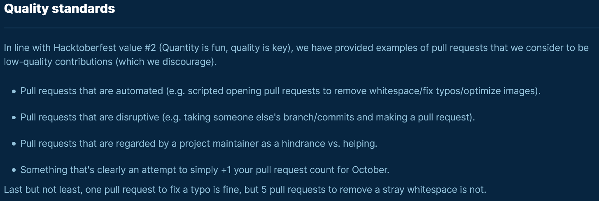

<h1 align="center">Hacktoberfest 2020</h1>

**New to Open Source and GitHub but want to participate in Hacktoberfest?**

This repository encourages Code Newbies to make their first pull request by doing the following simple yet valid tasks:

[1. Introduce yourself to Open Source Community](intro/)

[2. Create a Technical Blog](blogs/)

## About Hacktoberfest

Hacktoberfest — brought to you by DigitalOcean in partnership with Dev & Intel — is a month-long celebration of open source software. Maintainers are invited to guide would-be contributors towards issues that will help move the project forward, and contributors get the opportunity to give back to both projects they like and others they've just discovered. No contribution is too small — bug fixes and documentation updates are valid ways of participating.

Can't make it to this online meetup? Hacktoberfest is virtual and open to participants from around the globe. [Sign up to participate today](https://hacktoberfest.digitalocean.com).

## Rules and Rewards

First, sign up on the Hacktoberfest site at https://hacktoberfest.digitalocean.com. To qualify for the official limited edition Hacktoberfest shirt, you must register and make four pull requests between October 1-31. Pull requests can be to any public repo on GitHub, not just the ones with issues labeled Hacktoberfest. If a maintainer reports your pull request as spam or spammy behavior, or not in line with the project’s code of conduct, you will be ineligible to participate.

## Don't know about GitHub and Open Source?

StatusNeo is conducting a virtual meetup to help you get started in your open source journey by introuducing you to the concepts of source code management and version control using Git VCS and the most popular Git hosting service, GitHub.
We firmly believe that the knowledge and experience you would take away from this workshop would help you in succesfully participating in Hacktoberfest 2020.

Register for the meetup at https://organize.mlh.io/participants/events/4403-hacktoberfest-2020-introduction-to-git-and-github

## Collaboration Guidelines

Please follow the contribution [guidelines](docs/CONTRIBUTING.md) to participate in this repository.

Adhere to the following [Code of Conduct](docs/CODE_OF_CONDUCT.md).

## Quality Checks

We firmly believe in quality PRs. Though this repository is meant for beginners, we discourage PRs with single character changes and whitespaces errors.

Only quality PRs matching all criterias and rules would be merged.

## License

This repository follows the [MIT License](LICENSE)

